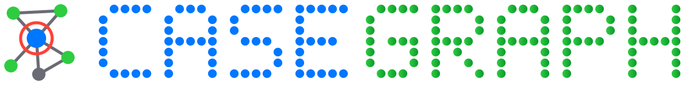

<p align="center">
  
</p>

<p align="center">
  
</p>

<h1 align="center">CaseGraph</h1>

<p align="center">
  <b>An alert comes in. A defensible case goes out.</b><br>
  A fraud-investigation agent that reads the bank's graph through TigerGraph MCP, remembers every
  case it has closed, asks for evidence when the signals disagree, and changes its mind when the answer comes back.
</p>

<p align="center">
  
  
  
  
  
  
</p>

<p align="center">
  <a href="http://hhgoa.com/"></a>
</p>

<p align="center">
  <a href="#the-idea">The idea</a> ·
  <a href="#results-on-the-20-cases">Results</a> ·
  <a href="#architecture">Architecture</a> ·
  <a href="#how-tigergraph-is-used">TigerGraph</a> ·
  <a href="#run-it">Run it</a> ·
  <a href="#known-limitations">Limitations</a>
</p>

---

## The idea

A risk score is a reason to look, never a verdict. Above 0.7, most of this bank's alerts are
legitimate, and some fraud scores near zero. So CaseGraph does not start from the score. It starts
from the **graph around the alert**: the cardholder's own history, the device and who else used it, the
billing region, and every closed case that touches any of them. It weighs that evidence, and when the
evidence is not enough to act, it asks for more through the controls the policy allows
(customer verification, step-up authentication). Then it acts inside the bank's permissions.

Three decisions shape the design:

- **The LLM reasons and writes; it does not do graph analysis and it does not choose actions.** GSQL
  queries and a graph algorithm find the patterns. A small policy engine turns the assessment into the
  policy's exact action identifiers, approval routes and report decision, and cites the rule for each.
  Gemini picks which extra graph tools to call and writes the case summary and the SAR narrative.
- **A "customer" is not a person here.** In this data a `customer_id` is an issuer bucket that can hold
  10,000 transactions across 30 billing regions. CaseGraph infers the individual cardholder, a
  **Holder** (card + billing region + the day the card relationship began), and investigates at that
  level. In the bank's own closed cases, same-holder neighbours of a confirmed fraud were fraud **67%**
  of the time; other transactions on the same card, **2.3%**.
- **Memory is in the graph.** The 5,565 closed cases are vertices with two vectors each: the analyst
  narrative, and a 16-dimension *behavioural fingerprint* of the episode. Every case the agent closes
  is written back the same way, with its event log, links and vectors, so the next investigation finds
  it by graph proximity *and* by similarity.

```mermaid
flowchart LR
    T["🔔 trigger<br/>risk score · customer · analyst · monitor"] --> O["open case<br/>(graph)"]
    O --> G["gather<br/>GSQL via MCP"]
    G --> P{"LLM planner<br/>more tools?"}
    P -->|yes| G
    P -->|no| A["analyse<br/>signals + ring WCC"]
    A --> M["recall memory<br/>graph links + TigerVector"]
    M --> U{"uncertain?<br/>policy §6"}
    U -->|"p ≥ 0.85 or ≤ 0.15<br/>2+ evidence lines"| F["final actions"]
    U -->|otherwise| R["request evidence<br/>verify · step-up"]
    R --> S["re-assess"] --> F
    F --> W["write case text<br/>LLM + GraphRAG"]
    W --> K["persist case<br/>vertices · edges · vectors"]
```



---

## Results on the 20 cases

All 20 answer files are in [`cases/`](cases/) and pass `python -m casegraph check`: format, enum values,
every ID exists in the dataset, exposure equals the sum of the affected transactions, routes match
the policy (including the $2,500 `BLOCK_CARD` split), `FILE_REPORT` ⇔ `sar.file`, R10.

| Case | Trigger | Verdict | p | Pattern | Exposure | Initial → final action | SAR |
|---|---|---|---:|---|---:|---|:-:|
| HHG-001 | risk score | legitimate | 0.04 | none | $0.00 | `ALLOW_TRANSACTION, CLOSE_NO_FRAUD` | — |
| HHG-002 | risk score | legitimate | 0.04 | none | $0.00 | `STEP_UP_AUTH, VERIFY_WITH_CUSTOMER, MONITOR_CARD` → `ALLOW_TRANSACTION, CLOSE_NO_FRAUD` | — |
| HHG-003 | customer | legitimate | 0.04 | none | $0.00 | `VERIFY_WITH_CUSTOMER` → `CLOSE_NO_FRAUD` | — |
| HHG-004 | customer | legitimate | 0.04 | none | $0.00 | `VERIFY_WITH_CUSTOMER, MONITOR_CARD` → `CLOSE_NO_FRAUD` | — |
| HHG-005 | risk score | legitimate | 0.04 | none | $0.00 | `STEP_UP_AUTH, VERIFY_WITH_CUSTOMER, MONITOR_CARD` → `ALLOW_TRANSACTION, CLOSE_NO_FRAUD` | — |
| HHG-006 | customer | fraud | 0.91 | undocumented | $1,906.07 | `BLOCK_CARD, FILE_REPORT, ESCALATE_TO_ANALYST` | ✅ |
| HHG-007 | risk score | uncertain | 0.41 | account takeover | $111.92 | `VERIFY_WITH_CUSTOMER, MONITOR_CARD` → `DECLINE_TRANSACTION, MONITOR_CARD` | — |
| HHG-008 | customer | fraud | 0.90 | card not present fraud | $55.68 | `BLOCK_CARD` | — |
| HHG-009 | customer | fraud | 0.90 | card not present fraud | $30.02 | `BLOCK_CARD` | — |
| HHG-010 | risk score | legitimate | 0.04 | none | $0.00 | `VERIFY_WITH_CUSTOMER` → `ALLOW_TRANSACTION, CLOSE_NO_FRAUD` | — |
| HHG-011 | customer | fraud | 0.96 | card not present new device | $131.30 | `VERIFY_WITH_CUSTOMER, MONITOR_CARD` → `BLOCK_CARD, MONITOR_CONNECTED_CARDS, FILE_REPORT` | ✅ |
| HHG-012 | risk score | legitimate | 0.04 | none | $0.00 | `VERIFY_WITH_CUSTOMER, MONITOR_CARD` → `ALLOW_TRANSACTION, CLOSE_NO_FRAUD` | — |
| HHG-013 | risk score | legitimate | 0.04 | none | $0.00 | `VERIFY_WITH_CUSTOMER` → `ALLOW_TRANSACTION, CLOSE_NO_FRAUD` | — |
| HHG-014 | analyst | fraud | 0.97 | undocumented | $439.61 | `BLOCK_CARD, MONITOR_CONNECTED_CARDS, FILE_REPORT, ESCALATE_TO_ANALYST` | ✅ |
| HHG-015 | risk score | legitimate | 0.04 | none | $0.00 | `VERIFY_WITH_CUSTOMER` → `ALLOW_TRANSACTION, CLOSE_NO_FRAUD` | — |
| HHG-016 | customer | fraud | 0.96 | card not present new device | $59.67 | `VERIFY_WITH_CUSTOMER, MONITOR_CARD` → `BLOCK_CARD` | — |
| HHG-017 | risk score | legitimate | 0.04 | none | $0.00 | `ALLOW_TRANSACTION, CLOSE_NO_FRAUD` | — |
| HHG-018 | customer | fraud | 0.93 | out of region use | $124.08 | `VERIFY_WITH_CUSTOMER, MONITOR_CARD` → `BLOCK_CARD` | — |
| HHG-019 | risk score | fraud | 0.97 | card not present new device | $99.92 | `BLOCK_CARD, MONITOR_CONNECTED_CARDS, FILE_REPORT` | ✅ |
| HHG-020 | risk score | legitimate | 0.04 | none | $0.00 | `STEP_UP_AUTH, VERIFY_WITH_CUSTOMER, MONITOR_CARD` → `ALLOW_TRANSACTION, CLOSE_NO_FRAUD` | — |

**What it found that the trigger did not say:**

| Case | Finding |
|---|---|
| HHG-006 | **Undocumented: purchases structured under a limit.** Four online purchases in 30 minutes, $456.96 to $488.04, each just under $500, from two device profiles new to the account. The customer reported one ($482.12); the agent found all four ($1,906.07) and matched five closed cases with the same shape. |
| HHG-014 | **Undocumented: a device ring.** The connected-components query puts the card in a group of 28 cards and 59 cardholders joined by one device profile (Samsung SM-G935F, Chrome 62, 1920x1080), 100% New-to-account, 100% behind an anonymous proxy. The same profile appears on four closed cases from August and September. |
| HHG-019 | **Shared origin, found on other cards.** A $99.92 purchase from a device profile used on four other cards within three days, all around $100, all New, all scoring high. Report filed under R6, connected cards monitored. |
| HHG-011 | **Shared origin again.** The customer's $131.30 came from a handset profile seen on only four cards in six months: the other three used it within three days for $125–131. |
| HHG-018 | **A cardholder compromised before.** The Holder behind this $39.08 had four confirmed out-of-region frauds in the previous 120 days; the episode includes the same holder's other purchases around the alert. |
| 10 of 11 risk-score alerts | Scores of 0.52 to 0.90 contradicted by the cardholder's own history. Where the score was strong the agent **verified before closing**, as the bank did for all 900 cleared alerts in its history. |

**Beyond the 20.** [`monitor/`](monitor/) holds investigations the agent opened on its own: it slides a
14-day window over November and December, runs the ring query, and investigates device groups nobody
raised an alert on. Groups already covered by an exam case are skipped. On the exam period it found
five candidate groups, skipped the one already covered by HHG-014, and opened four cases (MON-001 to MON-004),
three of them with a report.

**Cost of the run on Savanna:** 239 graph calls through MCP, 168k Gemini tokens, 15.5 minutes for all 20
cases (the free-tier LLM dominates the latency; the graph queries take 10–300 ms each).

Technical write-up: [`docs/blog.md`](docs/blog.md).

---

## Architecture

```
casegraph/
├── model/casememory.py     learn from the closed cases (no public labels) → model_prob on every txn
├── etl/prepare.py          card IDs, Holders, device profiles, NEXT ordering → vertex/edge CSVs
├── graph/
│   ├── schema.gsql         13 vertex types, 26 edge types, 5 vector attributes
│   ├── queries/*.gsql      12 installed queries (context, behaviour, window, device, region,
│   │                       prior cases, recurring, ring WCC, 4 vector searches)
│   └── setup.py            schema → chunked REST loading → install (same code for Savanna and CE)
├── rag/                    local embeddings, fingerprints, knowledge build (policy, typologies, FinCEN)
├── agent/
│   ├── mcp_client.py       every graph call goes through the tigergraph-mcp server (stdio)
│   ├── tools.py            typed tools + trace (tool, args, latency, transport)
│   ├── signals.py          detectors: card testing, structuring, recurring, …
│   ├── investigator.py     the loop: gather → plan → analyse → recall → assess → act → write → persist
│   ├── policy.py           Fraud Policy v1.0 as code: actions, routes, R1–R10, §3a report rule, §6 stop
│   ├── llm.py              Gemini planner (function calling) + writer (structured output)
│   └── memory.py           write the case into the graph
├── monitor.py              autonomous scan → monitor/
├── checks.py               answer-file validator
└── ui/app.py               Streamlit analyst console
```

### The evidence model

Every finding is an `Evidence` item with the claim, its source (`graph` / `customer` / …), the query
it came from, the IDs it rests on, a **log-odds weight** and an **independence group**. The probability
starts from the case-memory model and moves with each finding. The policy's stopping rule ("≥ 0.85 or
≤ 0.15 *on at least two independent pieces of evidence*") counts groups, not findings, so two device
facts are one line of evidence.

Weights come from the bank's own history, not intuition. For example:

| Signal | What the closed cases say |
|---|---|
| case-memory model | out-of-time AUC **0.918** vs **0.866** for the bank's risk score (Oct hold-out) |
| holder had confirmed fraud before | fraud rate 22% vs 3.7% at the same model score |
| same-holder neighbour of a fraud | 67% fraud vs 2.3% |
| fingerprint neighbours | compared against the 84% fraud base rate of the closed cases, not 50% |

### Uncertainty, evidence requests and changing the recommendation

`policy.initial_plan` decides whether the agent can act now or must ask first. When it asks, the reply
is not in the data, so the agent **assumes the reply the evidence points to** and records it in
`evidence_requests`: a denial when p ≥ 0.55, a confirmation when p ≤ 0.35, and *no reply within
24 hours* in between, which drives R4 and R8 and leaves the case `open` or `escalated`. The
reply moves the probability, `policy.final_plan` recomputes the actions, and `what_changed` explains
the difference.

Force a different reply to watch the recommendation move:

```bash
python -m casegraph run HHG-002 --simulate deny      # → BLOCK_CARD, CREATE_CASE …
python -m casegraph run HHG-002 --simulate none      # → MONITOR_CARD, DECLINE_TRANSACTION (R4)
```

---

## How TigerGraph is used

| Capability | Where |
|---|---|
| **Graph schema + loading** | `graph/schema.gsql`, `graph/setup.py`. 600k-vertex, 3.3M-edge graph, loaded over REST in 16 MB chunks, so the same command works on Savanna. |
| **GSQL traversal** | `txn_context`, `behaviour_profile`, `card_window`, `device_neighbors`, `region_context`, `prior_cases`, `recurring_check`. Multi-hop, time-windowed, accumulator-based. |
| **Graph algorithm** | `device_ring`: label-propagation connected components on the Holder ↔ DeviceProfile graph inside a time window, restricted to *specific* devices. Finds rings in about 0.3 s. |
| **TigerVector** | `ClosedCase.emb`, `ClosedCase.fp`, `DocChunk.emb`, `InvestigationCase.emb`, `InvestigationCase.fp`, searched with `vectorSearch()` inside GSQL. |
| **GraphRAG** | Retrieved policy/typology/FinCEN chunks come back with their linked `Pattern` vertices; similar cases come back with their graph context; both are passed to the LLM as context, not raw rows. |
| **TigerGraph MCP** | `tigergraph-mcp` over stdio: `run_installed_query` for every investigation step, `upsert_vectors` for the knowledge build and case vectors, `add_node` / `add_edges` for case memory. |
| **Case memory** | `InvestigationCase` + `CaseEvent` vertices with `CASE_TXN`, `CASE_CARD`, `CASE_DEVICE`, `CASE_PATTERN`, `CASE_CITES` edges; read back by `prior_cases` and `similar_agent_cases`. |

---

## Run it

```bash
git clone https://github.com/0neHackers/casegraph.git && cd casegraph
python -m venv .venv && .\.venv\Scripts\Activate.ps1        # macOS/Linux: source .venv/bin/activate
pip install -r requirements.txt
copy .env.example .env                                         # fill in Savanna host + secret, Gemini key
```

Put the dataset files (`transactions.csv`, `identity.csv`, `closed_cases_history.csv`, `case_pack.csv`,
`README.md`) in `data/raw/`. Then:

```bash
bash scripts/bootstrap.sh            # ETL → schema → load → queries → knowledge → 20 cases → check
streamlit run casegraph/ui/app.py    # the analyst console
```

Or step by step:

```bash
python -m casegraph.etl.prepare
python -m casegraph.graph.setup all          # schema, load, install queries
python -m casegraph.rag.build                # vectors
python -m casegraph run --all                # cases/*.json, written to the graph, chronological order
python -m casegraph check
python -m casegraph.monitor                  # optional: autonomous scan → monitor/
```

The case-memory model's scores ship in `data/prepared/`; `python -m casegraph.model.casememory`
retrains it (about 3 minutes). With no `GEMINI_API_KEY` the agent still runs: a rule planner and
templates replace the LLM and the answer files record `tokens: 0`.

For local development on Community Edition, see `scripts/ce/run_community_edition.sh`.

---

## Known limitations

- **Customer replies are simulated.** The data has none. The agent assumes the reply the evidence points to and says
  so in every case file; `--simulate` shows the other branches.
- **In-person pattern labels are soft.** In the closed cases, account takeover and out-of-region use look
  almost the same for card-present fraud (a depth-3 tree separates them no better than the base rate).
  The agent names the pattern the evidence supports, but that distinction is weak by construction.
- **Holders are inferred.** Card + region + anchor day is a strong proxy for one cardholder, not an identity. Online
  purchases without a billing region share a looser holder, and the agent is more conservative there.
- **Gemini free tier.** About 20 requests per model per day. The client rotates across six Flash models on a 429,
  which covers the 20 cases and the monitor; heavier use needs a paid key.
- **Unnamed features stay unnamed.** The model uses the V/C/D/M/id columns as signals; the evidence says "model
  feature", never what a column "means".

---

<p align="center">
  
</p>
